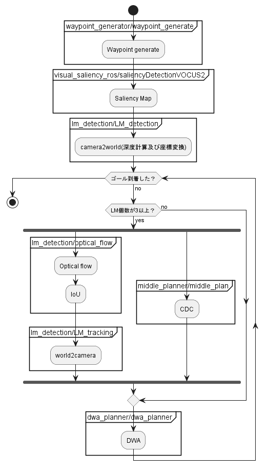

# CDC algorithm
これは軌道補正アルゴリズム(CDC)のROS適用を検討するものです。
# Abstract
- [Requirement](Requirement)
- [Installation](Installation)
- [Usage](Usage)
- [ProgramFlow](ProgramFlow)
- [References](References)
- [Author](Author)
- [Progress](Progress)
- [Tips](Tips)
# Requirement
* ROS1 melodic
# Installation

```
$ chmod +x install.sh
$ ./install.sh
```
visual saliency installation
```
$ cd visual_saliency_ros
$ git submodule update --init --recursive
$ cd ..
$ catkin build -DCMAKE_BUILD_TYPE=Release visual_saliency
$ source devel/setup.bash
```

# Usage
軌道補正アルゴリズムを起動,実行
```
$ roslaunch cdc_navigation cdc_base.launch
```
## Manual
 RvizのDisplayパネル上にあるwaypoint generate でwaypointを生成できる。しかし、現在が一つに入力でアルゴリズムが動作される。
# ProgramFlow
UML方式で記述しました。グループ名ではフォルダとファイルを現在のソースコードと同期させています。



# References
軌道補正アルゴリズム及び事前破綻検知について

    1 大舘和陽 移動ロボットの経路追従における経路破綻時の自律軌道補正計画(未公刊),Master’s thesis, 中央大学大学院理工学研究科, 2022.

LM観測と追従におけるロバスト性向上について

    1 Gabor Kovacs, Naoaki Hoshi, and Yasuharu Kunii. "Robustness improvement of
    long range landmark tracking for mobile robots". In 2018 IEEE/ASME International
    Conference on Advanced Intelligent Mechatronics (AIM), pp. 1196–1201, 2018.

    2 G Kovács, Y Kunii, T Maeda, H Hashimoto."Saliency and spatial information-based landmark selection for mobile robot navigation in natural environments".Advanced Robotics, Vol 33, num 10, pp. 520-535,2019.

※その他の軌道補正絡みの修士論文はNASに存在します。

# Author
大舘和陽(オオダチ トモアキ)　2022年度修了　連絡先　tomo990203@gmail.com 

# Progress
UMLに記載した大まかな軌道補正は実機同様に確認済み (2023/03/22) \
 ※実機ではカメラの三次元位置計測の計算がことなる。シミュレーションでは0.001で倍率を調整しているが実機検証では排除しているものとなる。

やるべきこと\
　・参考文献に載せているガボールの独自のROIとポテンシャル場によるLM選択を導入すること \
　  2023/03/22時点でlm_detection/weight_roi_creationにおいて途中まで書いています。

# Tips
役に立つことを示します。仮想環境関連です。自分でDockerfileを作成することも検討してください。
## docker installation

*https://qiita.com/iganari/items/fe4889943f22fd63692a

## use ros melodic in docker(GUI)

*https://qiita.com/karaage0703/items/957bdc7b4dabfc6639da

